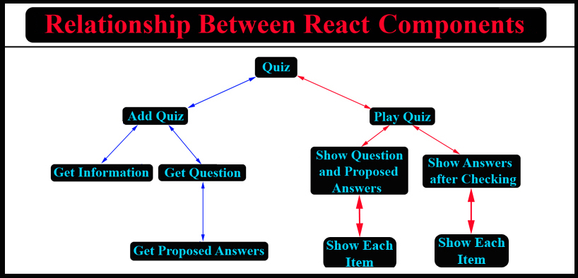
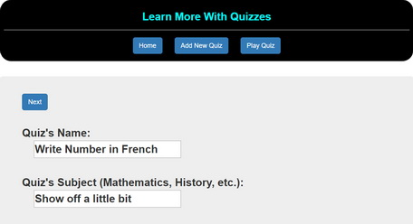
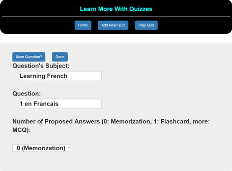
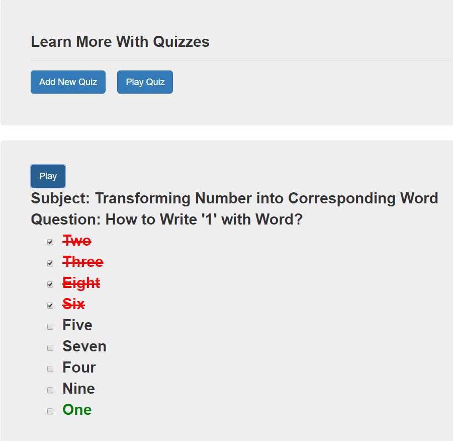

# QUIZ: 4 - Client/Server with MongoDB and React
---

## Aim
To build a program that execute customized-quiz: "**memorization**", "**flashcard**", "**true/false**", "**multiple choice questions**") everything is controlled totally by a **Graphic User Interface**.

The structure is a full "**3-tier Architecture**" with a **MVC**'s model.

**Goal**: learn how to create - dynamically or statically - object (**button**, **radio**, **form**, etc.) and how to handle them.

## Technologies
This is a version with **client-server** with utilisation of **MongoDB** for persistence and **ReactJS** for a reactive application.

### The Relationship Between React Components:

To see the relationship between **React** components in this project:

**Goal**: we have all sort of transmission of data:

* "**Vertical**": **parent** <--> **children** <--> **grand-children** <--> ...
* "**Horizontal**": interaction between **siblings**

### To Add New **Quiz**:

Add General Informations:

Add Question:

Add Proposed Answers:

### To use **Quiz**:

 
## Execution
1. Execute "**npm install**" to install dependencies
2. No need to start a database server: we are using the "**mLab**"
3. Execute "**npm run build**" to execute **webpack** following by run the **server**.
4. Open a browser and enter any of following:
	* "**localhost:8080**" to get the homepage,
	* "**localhost:8080/add**" to add more test,
	* "**localhost:8080/play**" to play a test ...

## Limitation
We need to manage **lifecycle** of each connection: each user should have his (her) own test so they could "**play**" at the same time (which, with this version, we could not do it). However, it should be easy to fix: create **class/object** for each user and put them into a sort of **pool**.

## Evolution
* **Short term**: have selection of quizzes, mix them, complete **CRUD** operations. Use **Angular** and/or **ReactJS** for the **view**.
* **Long term**: add **tests** into a global structure (we could use the **Dewey Decimal Classification**) so we could have all sort of data about each subject (mostly for personal use so we could centralize all acknowledge in a same place): 
	- **documents**
	- **tests**
	- **videos**
	- etc.

## Author
* Dinh HUYNH - All Rights Reserved!
* dinh.hu19@yahoo.com

